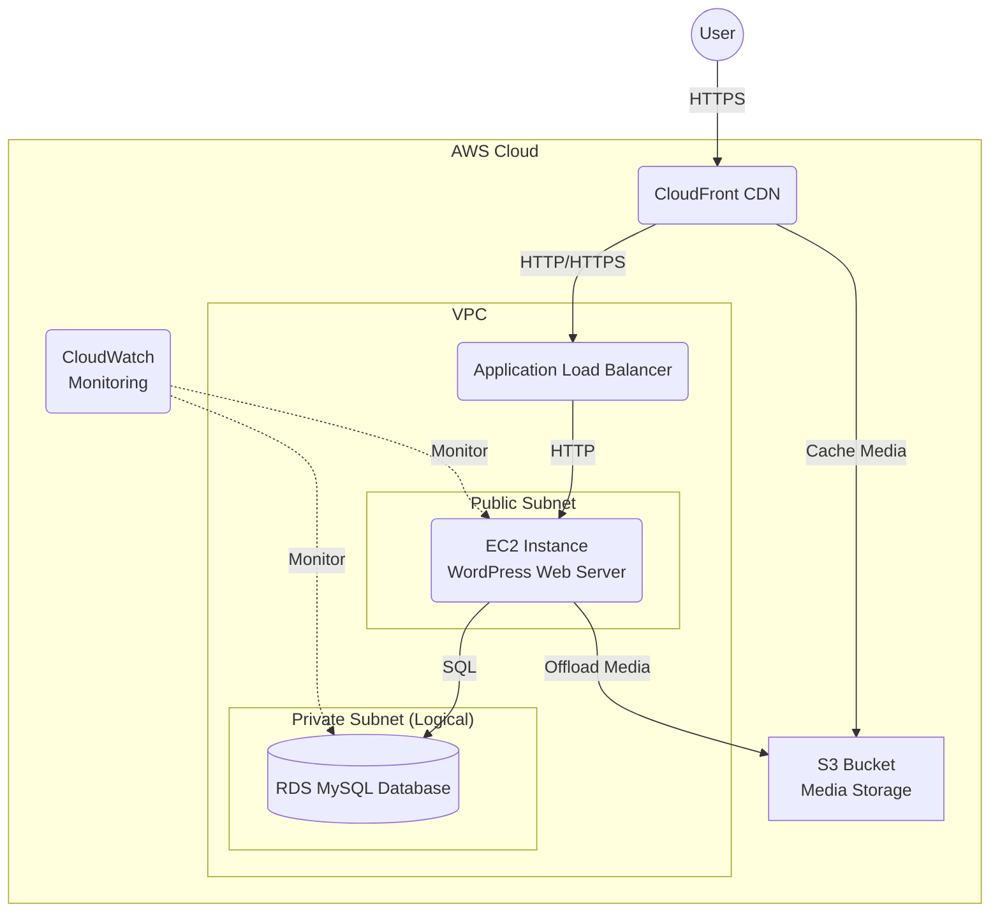

# AWS Cloud Architecture for WordPress

## Description
1.  **User** accesses the blog via CloudFront (CDN) for low latency.
2.  **CloudFront** serves cached content and routes dynamic requests to the Load Balancer (or directly to EC2 if no ALB is used in strict Free Tier minimal setup, though ALB is good practice). *Note: For strict Free Tier cost avoidance, you might skip ALB and go CloudFront -> EC2 Elastic IP, but ALB is shown for architectural completeness.*
3.  **EC2 Instance** hosts the WordPress application (Apache/Nginx + PHP).
4.  **RDS** hosts the MySQL database, ensuring data persistence separate from the web server.
5.  **S3** stores media uploads (images/videos) to offload storage from EC2 and allow cheaper scaling.
6.  **CloudWatch** monitors CPU, memory, and disk usage of EC2 and RDS.
