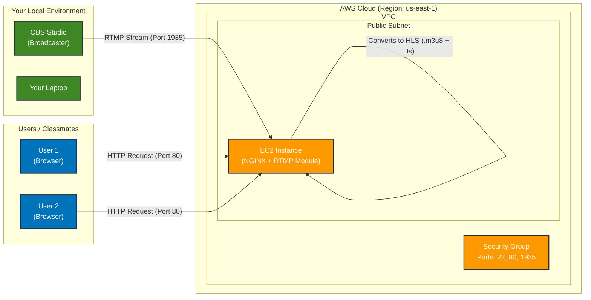

# Architecture Diagram: AWS Live Streaming

```mermaid
graph LR
    subgraph Local["Your Local Environment"]
        OBS["OBS Studio<br/>(Broadcaster)"]
        Laptop["Your Laptop"]
    end

    subgraph AWS["AWS Cloud (Region: us-east-1)"]
        subgraph VPC["VPC"]
            subgraph Subnet["Public Subnet"]
                EC2["EC2 Instance<br/>(NGINX + RTMP Module)"]
            end
            SG["Security Group<br/>Ports: 22, 80, 1935"]
        end
    end

    subgraph Users["Users / Classmates"]
        User1["User 1<br/>(Browser)"]
        User2["User 2<br/>(Browser)"]
    end

    OBS -->|"RTMP Stream (Port 1935)"| EC2
    EC2 -->|"Converts to HLS (.m3u8 + .ts)"| EC2
    User1 -->|"HTTP Request (Port 80)"| EC2
    User2 -->|"HTTP Request (Port 80)"| EC2

    classDef aws fill:#FF9900,stroke:#232F3E,stroke-width:2px,color:white
    classDef local fill:#3F8624,stroke:#232F3E,stroke-width:2px,color:white
    classDef user fill:#0073BB,stroke:#232F3E,stroke-width:2px,color:white

    class EC2,SG aws
    class OBS,Laptop local
    class User1,User2 user
```
